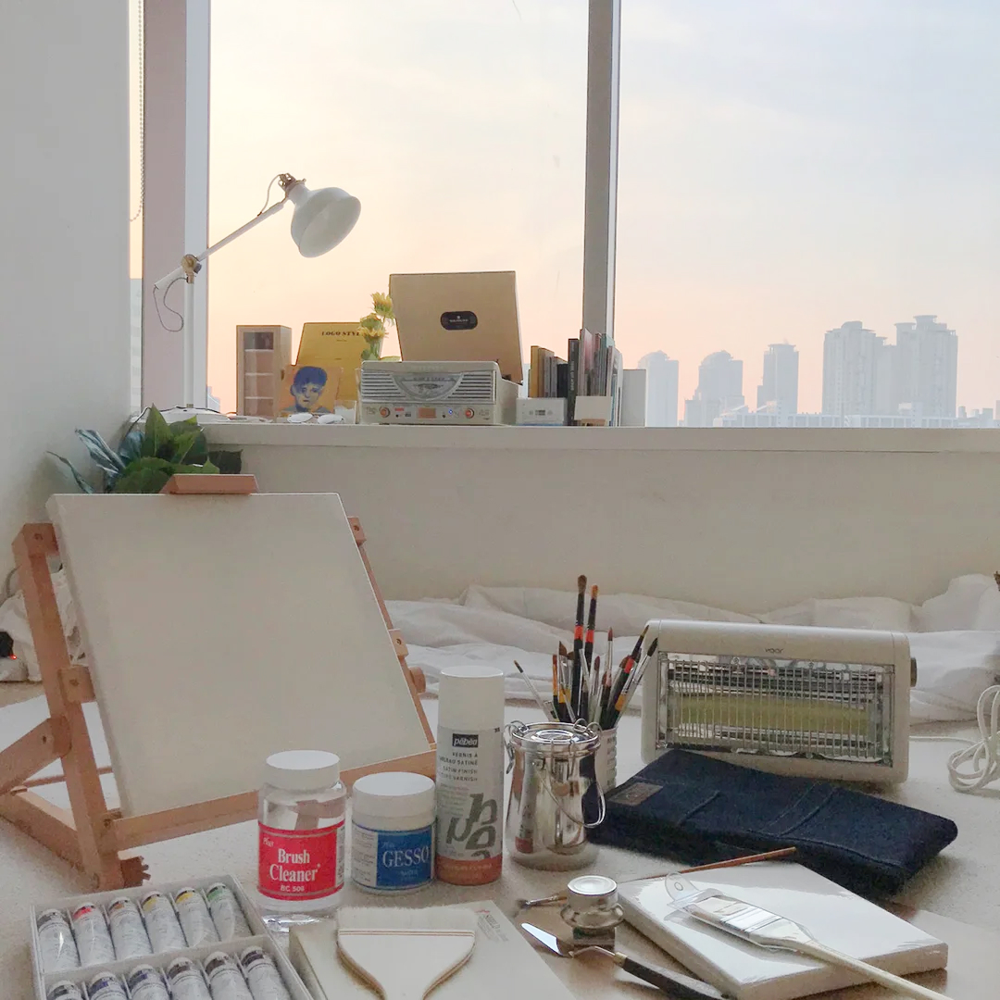

오늘의집

### 1. GNB

- 로그인을 하지 않은 경우

```html
<div class="button-group">
  <button
    class="gnb-icon-button is-search lg-hidden"
    type="button"
    aria-label="검색창 열기 버튼"
  >
    <i class="ic-search"></i>
  </button>

  <a
    class="gnb-icon-button is-cart"
    href="/"
    aria-label="장바구니 페이지로 이동"
  >
    <i class="ic-cart"></i>
    <strong class="badg">6</strong>
  </a>

  <div class="gnb-auth sm-hidden">
    <a href="/">로그인</a>
    <a href="/">회원가입</a>
  </div>
</div>
```

- 로그인을 했을 경우

```html
<div class="button-group">
  <button
    class="gnb-icon-button is-search lg-hidden"
    type="button"
    aria-label="검색창 열기 버튼"
  >
    <i class="ic-search"></i>
  </button>

  <a
    class="gnb-icon-button sm-hidden"
    href="/"
    aria-label="스크랩북 페이지로 이동"
  >
    <i class="ic-bookmark"></i>
  </a>

  <a
    class="gnb-icon-button sm-hidden"
    href="/"
    aria-label="내 소식 페이지로 이동"
  >
    <i class="ic-bell"></i>
  </a>

  <a
    class="gnb-icon-button is-cart"
    href="/"
    aria-label="장바구니 페이지로 이동"
  >
    <i class="ic-cart"></i>
    <strong class="badg">6</strong>
  </a>

  <button
    class="gnb-avatar-button sm-hidden"
    type="button"
    aria-label="마이메뉴 열기 버튼"
  >
    <div class="avatar-32">
      
    </div>
  </button>
</div>
```

### 2. sidebar

- 로그인을 하지 않은 경우

```html
<div class="sidebar-auth">
  <a class="btn-outlined btn-40" href="/">로그인</a>
  <a class="btn-fill-primary btn-40" href="/">회원가입</a>
</div>
```

- 로그인을 했을 경우

```html
<div class="sidebar-user-menu">
  <ul class="user-menu-list">
    <li class="user-menu-itme"><a href="/">마이페이지</a></li>
    <li class="user-menu-itme"><a href="/">나의 쇼핑</a></li>
    <li class="user-menu-itme"><a href="/">스크랩북</a></li>
    <li class="user-menu-itme"><a href="/">알림</a></li>
    <li class="user-menu-itme"><a href="/">이벤트</a></li>
  </ul>
</div>
```

### 3.Product-review

- 리뷰가 있을 경우

```html
<section
  class="product-section product-review"
  id="product-review"
  role="tabpanel"
>
  <header class="product-section-header">
    <h1 class="title">리뷰</h1>
    <strong class="badge" aria-label="566개">566</strong>
    <a class="text-button" href="/">리뷰쓰기</a>
  </header>

  <div class="product-section-content">
    <div class="review-scoreboard">
      <div class="score-summary">
        <strong class="average-score" aria-label="평점 4.8">4.8</strong>
        <div class="star-rating">
          <i class="ic-star is-active"></i>
          <i class="ic-star is-active"></i>
          <i class="ic-star is-active"></i>
          <i class="ic-star is-active"></i>
          <i class="ic-star is-active"></i>
        </div>
      </div>
      <div class="score-detail">
        <dl class="score-stats-list">
          <div class="score-stats-item is-active">
            <dt>5점</dt>
            <dd>
              <div class="bar-graph" aria-hidden>
                <div class="active-bar"></div>
              </div>
              <strong class="count" aria-label="467명">467</strong>
            </dd>
          </div>

          <div class="score-stats-item">
            <dt>4점</dt>
            <dd>
              <div class="bar-graph" aria-hidden>
                <div class="active-bar"></div>
              </div>
              <strong class="count" aria-label="87명">87</strong>
            </dd>
          </div>

          <div class="score-stats-item">
            <dt>3점</dt>
            <dd>
              <div class="bar-graph" aria-hidden>
                <div class="active-bar"></div>
              </div>
              <strong class="count" aria-label="13명">13</strong>
            </dd>
          </div>

          <div class="score-stats-item">
            <dt>2점</dt>
            <dd>
              <div class="bar-graph" aria-hidden>
                <div class="active-bar"></div>
              </div>
              <strong class="count" aria-label="0명">0</strong>
            </dd>
          </div>

          <div class="score-stats-item">
            <dt>1점</dt>
            <dd>
              <div class="bar-graph" aria-hidden>
                <div class="active-bar"></div>
              </div>
              <strong class="count" aria-label="0명">0</strong>
            </dd>
          </div>
        </dl>
      </div>
    </div>

    <ol class="review-list">
      <li class="review-item">
        <article class="review-card">
          <header class="review-card-header">
            <h3 class="visually-hidden">유니 님이 작성한 리뷰</h3>

            <a class="avatar-24" href="/">
              
            </a>

            <div class="info">
              <a class="username" href="/">
                <strong>유니</strong>
              </a>

              <div class="detail">
                <div class="star-rating-13" aria-label="5.0점 / 5.0점">
                  <i class="ic-star is-active"></i>
                  <i class="ic-star is-active"></i>
                  <i class="ic-star is-active"></i>
                  <i class="ic-star is-active"></i>
                  <i class="ic-star is-active"></i>
                </div>

                <div class="misc">
                  <time datetime="2024-01-01">2024.01.01</time
                  ><span>오늘의집 구매</span>
                </div>
              </div>
            </div>
          </header>
          <div class="review-card-body">
            <p>
              집 전체를 데운다기보다는 틀어놓고 앞에 앉아있으면 따땃해지는
              정도예요. 불 꺼놓고 난로 켜고 담요 덮은 채로 커피 마시면 아주
              좋아요. 고양이도 좋아해요
            </p>
          </div>
          <footer class="review-card-footer">
            <button class="btn-outlined btn-32" type="button">
              도움이 돼요
            </button>

            <p>
              <strong><span>7</span>명</strong>에게 도움이 되었습니다.
            </p>
          </footer>
        </article>
      </li>

      <!-- NOTE: 유저 이미지가 없는 경우 -->
      <li class="review-item">
        <article class="review-card">
          <header class="review-card-header">
            <h3 class="visually-hidden">우유파이 님이 작성한 리뷰</h3>

            <a
              class="avatar-24"
              href="/"
              aria-label="우유파이 님의 프로필로 이동"
            ></a>

            <div class="info">
              <a class="username" href="/">
                <strong>우유파이</strong>
              </a>

              <div class="detail">
                <div class="star-rating-13" aria-label="5.0점 / 5.0점">
                  <i class="ic-star is-active"></i>
                  <i class="ic-star is-active"></i>
                  <i class="ic-star is-active"></i>
                  <i class="ic-star is-active"></i>
                  <i class="ic-star"></i>
                </div>

                <div class="misc">
                  <time datetime="2024-01-01">2024.01.01</time
                  ><span>오늘의집 구매</span>
                </div>
              </div>
            </div>
          </header>
          <div class="review-card-body">
            <p>
              작업실에서 손이 시려워서 책상 위에 올려서 쓸걸로 골랐습니다!
              아주아주 뜨듯하고 크기도 적당하고 민트 사고싶엇지만 품절 ㅠㅠ
            </p>
          </div>
          <footer class="review-card-footer">
            <button class="btn-outlined btn-32" type="button">
              도움이 돼요
            </button>

            <p>
              <strong><span>2</span>명</strong>에게 도움이 되었습니다.
            </p>
          </footer>
        </article>
      </li>

      <!-- NOTE: 유저가 리뷰 이미지를 올리는 경우  -->
      <li class="review-item">
        <article class="review-card">
          <header class="review-card-header">
            <h3 class="visually-hidden">우제를좋아합니다 님이 작성한 리뷰</h3>

            <a class="avatar-24" href="/">
              
            </a>

            <div class="info">
              <a class="username" href="/">
                <strong>우제를좋아합니다</strong>
              </a>

              <div class="detail">
                <div class="star-rating-13" aria-label="5.0점 / 5.0점">
                  <i class="ic-star is-active"></i>
                  <i class="ic-star is-active"></i>
                  <i class="ic-star is-active"></i>
                  <i class="ic-star is-active"></i>
                  <i class="ic-star is-active"></i>
                </div>

                <div class="misc">
                  <time datetime="2024-01-01">2024.01.01</time
                  ><span>오늘의집 구매</span>
                </div>
              </div>
            </div>
          </header>
          <div class="review-card-body">
            <div class="review-image">
              
            </div>
            <p>
              고양이가 좋아해요 ㅎㅎ 섬세한 온도조절이 안되는게 아쉽지만, 이
              가격 이 디자인이면 만족할 수 밖에 없어요 :) 좋습니다!
            </p>
          </div>
          <footer class="review-card-footer">
            <button class="btn-outlined btn-32" type="button">
              도움이 돼요
            </button>

            <p>
              <strong><span>7</span>명</strong>에게 도움이 되었습니다.
            </p>
          </footer>
        </article>
      </li>

      <!-- NOTE: 사용자가 도움됨을 체크, 도움됨 1+  -->
      <li class="review-item">
        <article class="review-card">
          <header class="review-card-header">
            <h3 class="visually-hidden">우젱 님이 작성한 리뷰</h3>

            <a class="avatar-24" href="/">
              
            </a>

            <div class="info">
              <a class="username" href="/">
                <strong>우젱</strong>
              </a>

              <div class="detail">
                <div class="star-rating-13" aria-label="5.0점 / 5.0점">
                  <i class="ic-star is-active"></i>
                  <i class="ic-star is-active"></i>
                  <i class="ic-star is-active"></i>
                  <i class="ic-star"></i>
                  <i class="ic-star"></i>
                </div>

                <div class="misc">
                  <time datetime="2024-01-01">2024.01.01</time
                  ><span>오늘의집 구매</span>
                </div>
              </div>
            </div>
          </header>
          <div class="review-card-body">
            <p>
              오래된 아파트 확장된 방이라 외풍이 너무 심해 급하게 구매했습니다!
              예약배송이라 10일 가까이 기다렸는데 너무너무 만족스러워요~ :) 방이
              큰 편이라 전체가 다 따뜻해지길 바라지도 않았고, 후기를 먼저
              봤던터라 크게 기대를 안햇었는데 기대 이상입니다. 틀어놓으면 확실히
              방 공기가 달라져요! 후끈!!! 까진 아니어도 차가운 공기가
              따뜻해집니다~ 만족스러워요!!! 올 겨울 덕분에 떨지 않고 보낼 수
              있을것 같습니당
            </p>
          </div>
          <footer class="review-card-footer">
            <button class="btn-fill-primary btn-32" type="button">
              <i class="ic-check" aria-hidden></i>
              도움됨
            </button>

            <p>
              <strong><span>1</span>명</strong>에게 도움이 되었습니다.
            </p>
          </footer>
        </article>
      </li>

      <!-- NOTE: 사용자가 도움됨을 미체크, 도움됨 x  -->
      <li class="review-item">
        <article class="review-card">
          <header class="review-card-header">
            <h3 class="visually-hidden">랄로 님이 작성한 리뷰</h3>

            <a class="avatar-24" href="/">
              
            </a>

            <div class="info">
              <a class="username" href="/">
                <strong>랄로</strong>
              </a>

              <div class="detail">
                <div class="star-rating-13" aria-label="5.0점 / 5.0점">
                  <i class="ic-star is-active"></i>
                  <i class="ic-star is-active"></i>
                  <i class="ic-star"></i>
                  <i class="ic-star"></i>
                  <i class="ic-star"></i>
                </div>

                <div class="misc">
                  <time datetime="2024-01-01">2024.01.01</time
                  ><span>오늘의집 구매</span>
                </div>
              </div>
            </div>
          </header>
          <div class="review-card-body">
            <p>가격 대비 만족합니다.</p>
          </div>
          <footer class="review-card-footer">
            <button class="btn-outlined btn-32" type="button">
              도움이 돼요
            </button>
          </footer>
        </article>
      </li>
    </ol>

    <div class="pagination">
      <!-- <button class="page-control page-prev" type="button">
                  <i class="ic-chevron"></i>
                </button> -->
      <ol class="page-list">
        <li class="page-item is-active"><a href="/">1</a></li>
        <li class="page-item"><a href="/">2</a></li>
        <li class="page-item"><a href="/">3</a></li>
        <li class="page-item"><a href="/">4</a></li>
        <li class="page-item"><a href="/">5</a></li>
      </ol>
      <button class="page-control page-next" type="button">
        <i class="ic-chevron"></i>
      </button>
    </div>
  </div>
</section>
<div class="product-section-dividor sm-only" aria-hidden></div>
```

- 리뷰가 0개일 경우

```html
<section
  class="product-section product-review"
  id="product-review"
  role="tabpanel"
>
  <header class="product-section-header">
    <h1 class="title">리뷰</h1>
    <strong class="badge" aria-label="0개">0</strong>
    <a class="text-button" href="/">리뷰쓰기</a>
  </header>

  <div class="product-section-content">
    <p class="review-empty">
      첫 리뷰를 남겨주세요!<br />
      최대 <strong>500P</strong>를 드립니다.
    </p>
  </div>
</section>
<div class="product-section-dividor sm-only" aria-hidden></div>
```

### 3. inquiry

- 문의가 있을때

```html
<section
  class="product-section product-inquiry is-open"
  id="product-inquiry"
  role="tabpanel"
>
  <header class="product-section-header">
    <h1 class="title">문의</h1>
    <strong class="badge" aria-label="96개">96</strong>
    <a class="text-button" href="/">문의 하기</a>
    <button
      class="icon-button sm-only is-right"
      type="button"
      aria-label="더보기"
    >
      <i class="ic-chevron" aria-hidden></i>
    </button>
  </header>

  <div class="product-section-content">
    <ol class="inquiry-list">
      <li class="inquiry-item">
        <article class="inquiry-card">
          <header class="inquiry-card-header">
            <h3 class="visually-hidden">지* 님이 남기신 문의</h3>
            <dl class="detail">
              <dt class="visually-hidden">구매 여부</dt>
              <dd>구매</dd>
              <dt class="visually-hidden">문의 유형</dt>
              <dd>상품</dd>
              <dt class="visually-hidden">답변 여부</dt>
              <dd>미답변</dd>
            </dl>
            <div class="misc">
              <strong>지*</strong>
              <time datetime="2021-01-02 21:41">
                2024년 1월 1일 12시 34분
              </time>
            </div>
          </header>

          <div class="inquiry-card-body">
            <div class="inquiry-content">
              <span aria-label="문의 내용">Q</span>
              <p>
                상품받았는데 <br />
                사용하면서 보니까 불들어오는곳 옆에 <br />
                하얀 부분이 갈색으로 얼룩져있는데 불량인가요...? <br />
                위험하지는 않겠죠? 다른분들 후기사진에는 다 깨끗한 것 같아서요!
                <br />
                사진첨부가없어서 텍스트로 설명하려 하니 애매하네요 ㅠㅠ
              </p>
            </div>
          </div>
        </article>
      </li>

      <!-- NOTE: 비밀글일 경우 -->
      <li class="inquiry-item">
        <article class="inquiry-card">
          <header class="inquiry-card-header">
            <h3 class="visually-hidden">랄* 님이 남기신 문의</h3>
            <dl class="detail">
              <dt class="visually-hidden">구매 여부</dt>
              <dd>비구매</dd>
              <dt class="visually-hidden">문의 유형</dt>
              <dd>상품</dd>
              <dt class="visually-hidden">답변 여부</dt>
              <dd>미답변</dd>
            </dl>
            <div class="misc">
              <strong>랄*</strong>
              <time datetime="2021-01-01 21:41">
                2024년 1월 1일 01시 01분
              </time>
            </div>
          </header>

          <div class="inquiry-card-body">
            <div class="inquiry-content">
              <span aria-label="문의 내용">Q</span>
              <p>
                <i class="ic-lock" aria-hidden></i>
                비밀글입니다.
              </p>
            </div>
          </div>
        </article>
      </li>

      <!-- NOTE: 답변이 달린 경우 -->
      <li class="inquiry-item">
        <article class="inquiry-card">
          <header class="inquiry-card-header">
            <h3 class="visually-hidden">우젱* 님이 남기신 문의</h3>
            <dl class="detail">
              <dt class="visually-hidden">구매 여부</dt>
              <dd>비구매</dd>
              <dt class="visually-hidden">문의 유형</dt>
              <dd>배송</dd>
              <dt class="visually-hidden">답변 여부</dt>
              <dd class="is-answered">답변완료</dd>
            </dl>
            <div class="misc">
              <strong>우젱*</strong>
              <time datetime="2023-12-20 12:34">
                2023년 12월 20일 12시 34분
              </time>
            </div>
          </header>

          <div class="inquiry-card-body">
            <div class="inquiry-content">
              <span aria-label="문의 내용">Q</span>
              <p>
                화이트 재입고 날짜 알려 주세요 그리고 4평 남짓 방에 두려고
                하는데 너무 가까울까요
              </p>
            </div>
            <div class="inquiry-content">
              <span aria-label="답변 내용">A</span>
              <div class="seller">
                <strong>OA</strong>
                <time datetime="2023-12-20 14:00">
                  2023년 12월 20일 14시 00분
                </time>
              </div>
              <p>
                현재 고객님의 주문 정보가 확인되지 않아 바로 안내드리지 못하는
                점 양해 부탁드립니다.<br />
                문의하신 제품의 경우 현재 주문폭주로 인한 예약 판매중으로 순차
                발송 진행되고 있습니다.<br />
                주문 시 최대한 빠른 발송 진행될 수 있도록 노력하겠습니다.<br />
                감사합니다.
              </p>
            </div>
          </div>
        </article>
      </li>
    </ol>

    <div class="pagination">
      <!-- <button class="page-control page-prev" type="button">
                  <i class="ic-chevron"></i>
                </button> -->
      <ol class="page-list">
        <li class="page-item is-active"><a href="/">1</a></li>
        <li class="page-item"><a href="/">2</a></li>
        <li class="page-item"><a href="/">3</a></li>
        <li class="page-item"><a href="/">4</a></li>
        <li class="page-item"><a href="/">5</a></li>
      </ol>
      <button class="page-control page-next" type="button">
        <i class="ic-chevron"></i>
      </button>
    </div>
  </div>
</section>
<div class="product-section-dividor sm-only" aria-hidden></div>
```

- 문의가 없을때

```html
<section
  class="product-section product-inquiry is-open"
  id="product-inquiry"
  role="tabpanel"
>
  <header class="product-section-header">
    <h1 class="title">문의</h1>
    <strong class="badge" aria-label="0개">0</strong>
    <a class="text-button" href="/">문의 하기</a>
    <button
      class="icon-button sm-only is-right"
      type="button"
      aria-label="더보기"
    >
      <i class="ic-chevron" aria-hidden></i>
    </button>
  </header>

  <div class="product-section-content">
    <p class="inquiry-empty">문의 내역이 없습니다.</p>
  </div>
</section>
<div class="product-section-dividor sm-only" aria-hidden></div>
```
